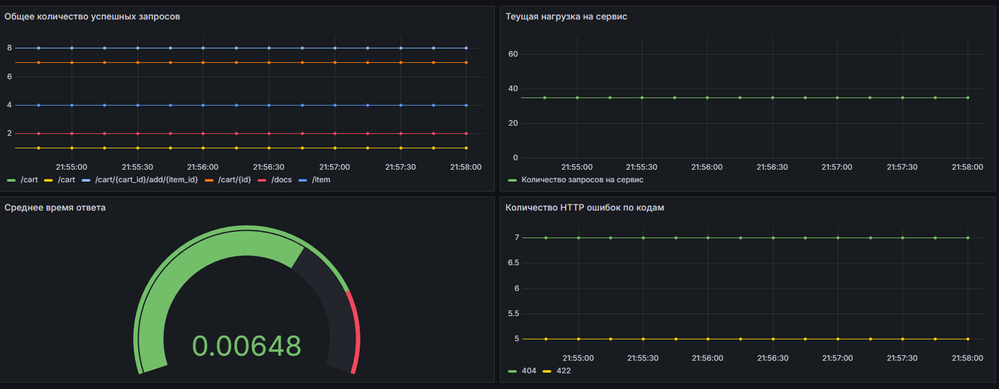
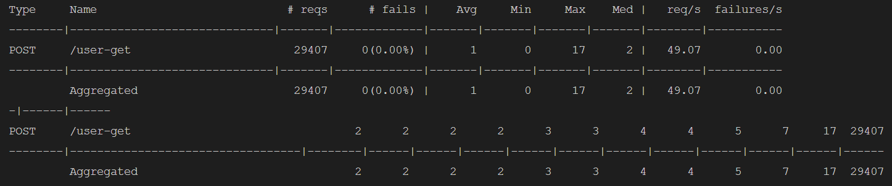
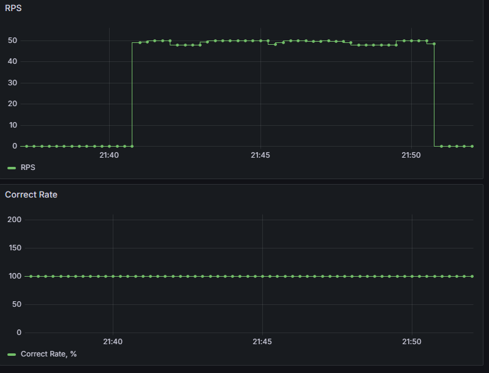

### Homework 3

<ins>Grafana Dashboard</ins>

### Homework 4

<ins>Команда для запуска тестов</ins>

`docker exec -it service locust --api-target-rps 10 --headless -u 10 -r 1 --run-time 10m -f /root/src/tests/load_tests/locustfile.py`

<ins>Отчёт Locust</ins>

<ins>Отчёт Grafana</ins>

